# SmartContract-Templates
Open source Burple smart contract templates for anyone to use.

This is our contribution to our community, we will be releasing more in the future.

[Burple Website](https://burple.tech/)
---

# ERC721 NFT Token Contract :rocket:
[](https://opensource.org/licenses/MIT)

## Objective

Create a [ERC-721](https://ethereum.org/en/developers/docs/standards/tokens/erc-721/) NFT smart contract and "Retrieve" a "Digital Asset" by its "Token ID".

The contract should cover the following functionality:

* Minting (Creation)
* Ownable
* Burnable
* Metadata Storage

## Initialize a development project in Remix IDE
1. Open [Remix IDE](https://remix.ethereum.org/) in Web Browser.
2. Create a ```Contract.sol``` file inside your Workspace.
3. Copy & Paste the code from [Burple_Contract-Templates](https://github.com/BurpleTech/SmartContract-Templates/blob/main/contract/ERC20TokenContract.sol)  public repo to your ```Contract.sol``` file. 

<p align="center">
  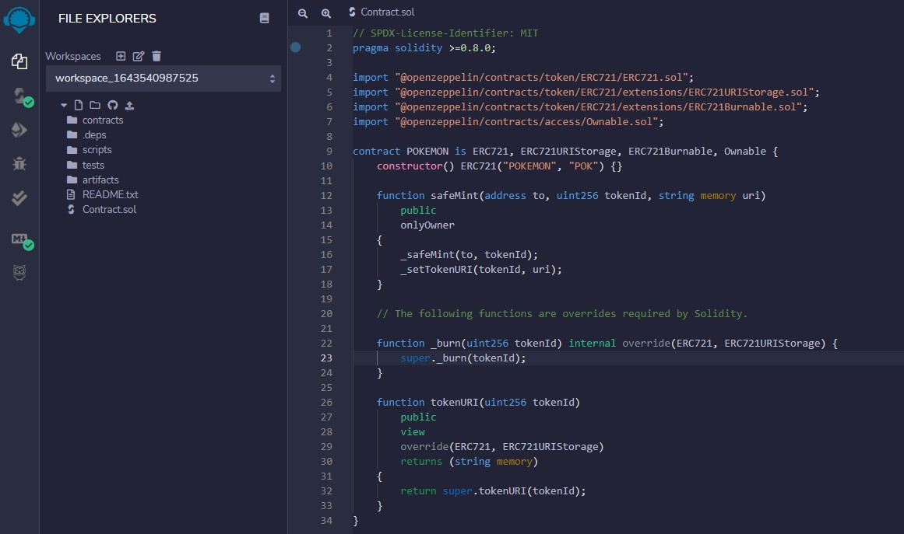
</p>

## Compile
- Solidity Compiler Plugin - Make sure, code compiles successfully without any errors.

<p align="center">
  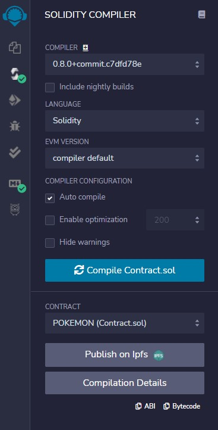
</p>

## Deploy using Ropsten Testnet
1. Deploy & Run Plugin - Select Injected Web3 Environment.
   1. Confirm, your Metamask wallet is connected. 
2. Select ```POKEMON - Contract.sol``` from the Contract dropdown.

<p align="center">
  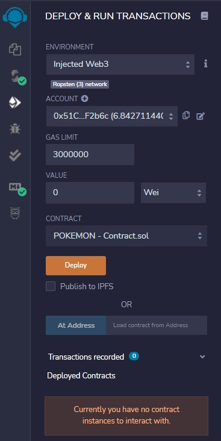
</p>

3. Click on the **Deploy** button.
4. Confirm the Contract Deployment Transaction. (Which will popup on your Metamask Wallet)


## Minting your NFT
1. Deployed Contract should look like below.

<p align="center">
  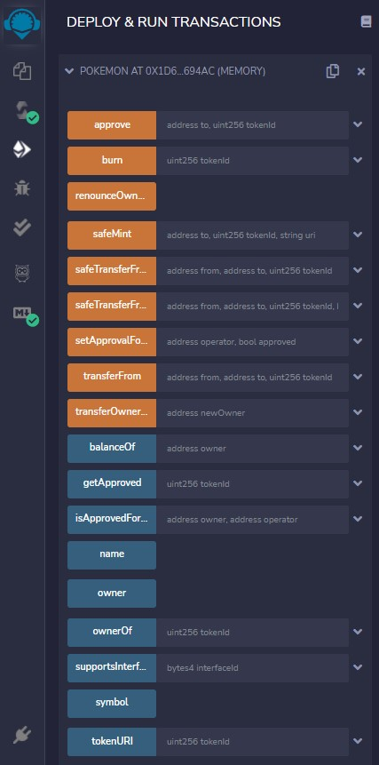
</p>

2. To Mint a NFT, ```safeMint``` function will be used.

<p align="center">
  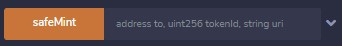
</p>

3. Expand the ```safeMint``` and pass the To: Address (Wallet address), TokenId: Id, Uri: IPFS pinned metadata file link.

<p align="center">
  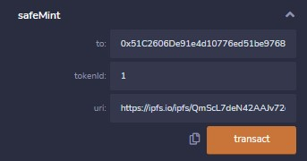
</p>

4. Click Transact and Confirm the safeMint Transaction. (Which will popup on your Metamask Wallet)


## Verify your NFT on Ropsten Testnet
1. Open [Ropsten Etherscan](https://ropsten.etherscan.io/)
2. Search for the ```To:``` Address or https://ropsten.etherscan.io/address/[To:Address] replace TO:Address with wallet address.
3. Below Balance, Token dropdown will appear.
4. Click on the dropdown and you should see your POKEMON NFT Listed

<p align="center">
  
</p>

Voila! You have deployed your ERC721 Smart Contract and Minted a NFT. :1st_place_medal:

# ERC20 Fungible Token Contract :rocket: :rocket:
[](https://opensource.org/licenses/MIT)

## Objective

Create a [ERC-20](https://ethereum.org/en/developers/docs/standards/tokens/erc-20/) smart contract.

The contract should cover the following functionality:

* Minting (Creation)
* Ownable
* Burnable

## Initialize a development project in Remix IDE
1. Open [Remix IDE](https://remix.ethereum.org/) in Web Browser.
2. Create a ```Contract.sol``` file inside your Workspace.
3. Copy & Paste the code from [Burple_Contract-Templates](https://github.com/BurpleTech/SmartContract-Templates/blob/main/contract/ERC721TokenContract.sol)  public repo to your ```Contract.sol``` file. 

<p align="center">
  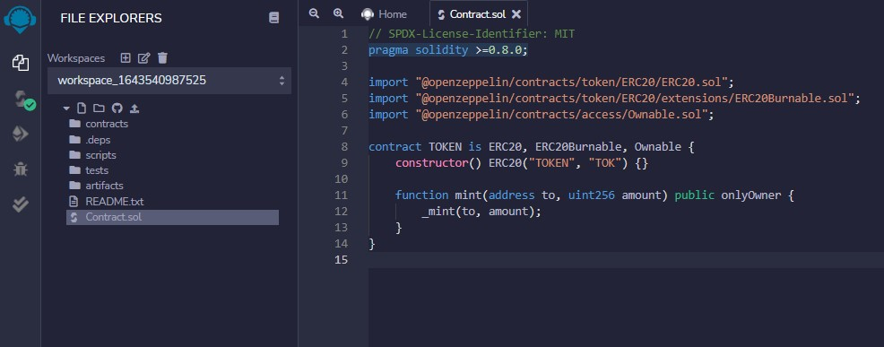
</p>

## Compile
- Solidity Compiler Plugin - Make sure, code compiles successfully without any errors.

<p align="center">
  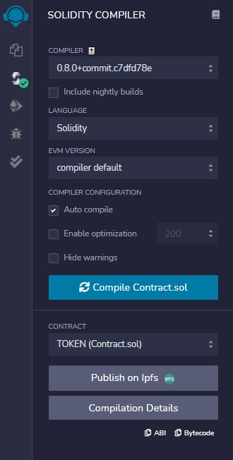
</p>

## Deploy using Ropsten Testnet
1. Deploy & Run Plugin - Select Injected Web3 Environment.
   1. Confirm, your Metamask wallet is connected. 
2. Select ```TOKEN - Contract.sol``` from the Contract dropdown.

<p align="center">
  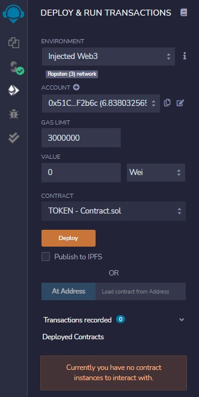
</p>

3. Click on the **Deploy** button.
4. Confirm the Contract Deployment Transaction. (Which will popup on your Metamask Wallet)


## Minting your NFT
1. Deployed Contract should look like below.

<p align="center">
  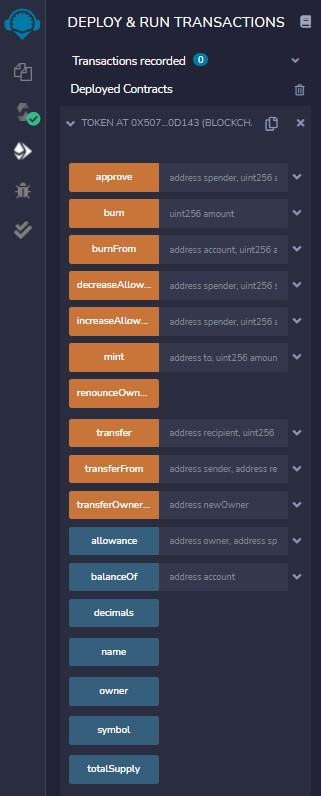
</p>

2. To Mint a Token, ```mint``` function will be used.

<p align="center">
  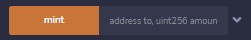
</p>

3. Expand the ```mint``` and pass the To: Address (Wallet address), Amount: Value (Amount in Decimals)

<p align="center">
  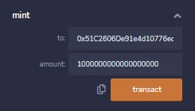
</p>

4. Click Transact and Confirm the mint Transaction. (Which will popup on your Metamask Wallet)


## Verify your Fungible Token on Ropsten Testnet
1. Open [Ropsten Etherscan](https://ropsten.etherscan.io/)
2. Search for the ```To:``` Address or https://ropsten.etherscan.io/address/[To:Address] replace TO:Address with wallet address.
3. Below Balance, Token dropdown will appear.
4. Click on the dropdown and you should see your POKEMON NFT Listed

<p align="center">
  
</p>

Voila! You have deployed your ERC20 Smart Contract and Minted a Fungible Token. :1st_place_medal:
